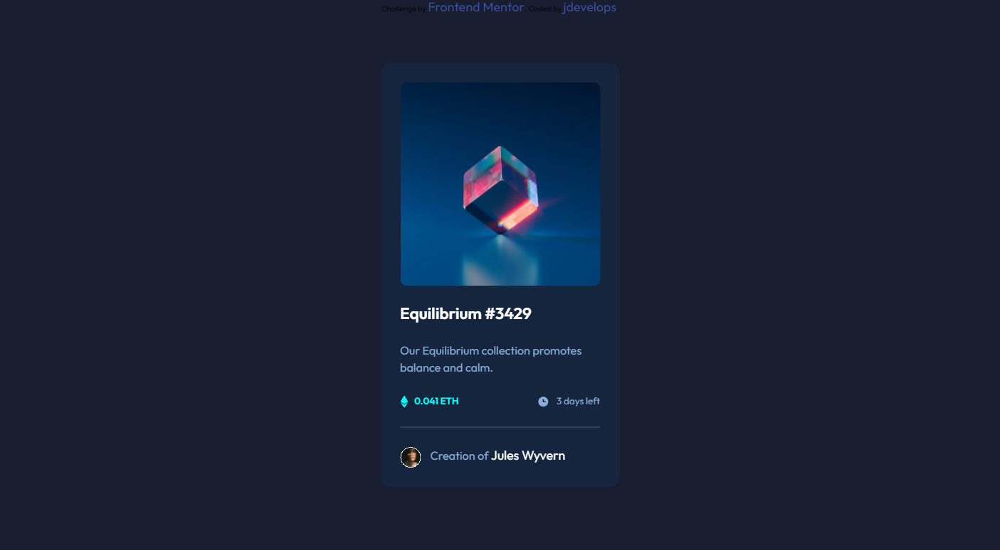

# Frontend Mentor - NFT preview card component solution

This is a solution to the [NFT preview card component challenge on Frontend Mentor](https://www.frontendmentor.io/challenges/nft-preview-card-component-SbdUL_w0U).

## Overview

This was my first challenge after little break, just a starter one
Went smoothly, but still need some work with little details, like <a> attribute sticking out of div.

In future i have to focus on mobile first design,

### The challenge

Users should be able to:

-   View the optimal layout depending on their device's screen size [done]
-   See hover states for interactive elements [done]

### Screenshot

### Links

-   Solution URL: [https://frontend-mentor-io-nft-card.vercel.app]

### Built with

-   Semantic HTML5
-   CSS
-   Flexbox

## Author

-   Frontend Mentor - [@jdev](https://www.frontendmentor.io/profile/jdevelops)
-   Github - [@jdevelops](https://github.com/jdevelops)
