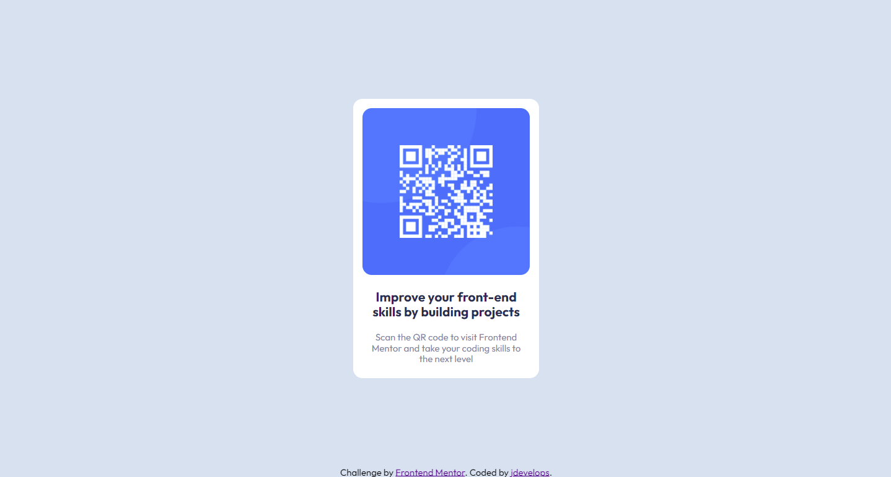

# Frontend Mentor - QR code component solution

This is a solution to the [QR code component challenge on Frontend Mentor](https://www.frontendmentor.io/challenges/qr-code-component-iux_sIO_H).

## Overview

This is my second challenge, using tips i got after first one i was able to build this site quite fast and reduce code by at least 30/40 %
BEM is great thing, i will be using it daily !
First time with Mobile-first workflow. Works great i think

### Screenshot

### Links

Site URL: [https://frontend-mentor-io-2-qr-code-component-main.vercel.app]

### Built with

-   Semantic HTML5 markup
-   CSS
-   Flexbox
-   BEM
-   Mobile-first workflow (yey)

## Author

-   Frontend Mentor - [@jdev](https://www.frontendmentor.io/profile/jdevelops)
-   Github - [@jdevelops](https://github.com/jdevelops)
